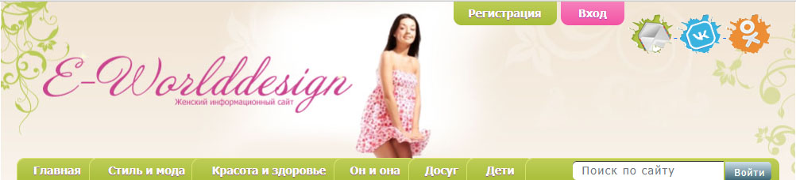

# e-worlddessign
Страничка женского информационного сайта
# 

#### 💻 верстка сайта выполнена по PSD макету, свободно распространяемому в интернете  
#### один из таких ресурсов может быть, например, 👉[freepic](https://ru.freepik.com/psd/web-templates)
#### макеты можно взять и на сайте 👉[figma](https://figma.com.ru/templates/)
#### При вестке страницы применена технология bootstrap 5.
#### Просто понравилась картикна и я решил сверстать.
#### ☺️а готовый продукт можно посмотреть 👉[тут](https://wdessign.github.io)

